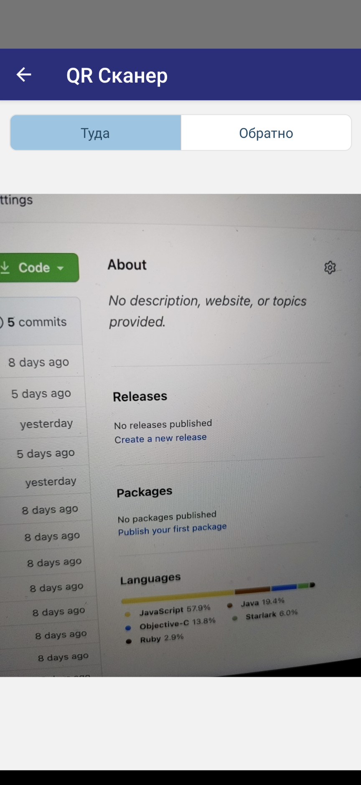

# QR сканнер для билетов «Укрзалізниці»

## Примеры

  
   
  

## Для разворачивания дев среды необходимо:

1.  склонить репу.
2.  установить npm модули (npm install)
3.  npx react-native run-android для адроида или cd ios/ && pod install && cd .. && npx react-native run-ios для яблока
